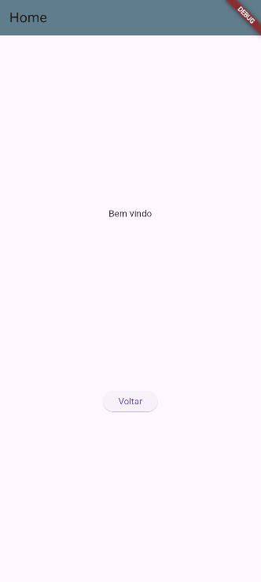

# Splash
Exemplo de uma **Splash Screen** com animação de entrada e saída com Flutter

## Tecnologias
- Flutter

|Efeitos|WidGets|
|-|:-:|
|Transparência / Opacidade|Opacity|
|Transformação|Transform|
|Imagens|Image.asset()|
|Assincronicidade|async|
|Controle de tempo|Timer|
|Controle de tamanho e opacidade|AnimationController|

|||
|-|-|
|Splash|Home|

# Para testar
- 1 Clone o repositório
- 2 Execute o comando `flutter pub get` para instalar as dependências
- 3 Execute o comando `flutter run` para rodar o projeto
- 4 O projeto irá abrir a tela de Splash e depois irá para a tela Home

## Aividades
- 1 Crie um splash com animação de movimento, carregando uma imagem aparecendo de cima para baixo até o centro da tela e em seguida redirecione para outra tela.
- 2 Crie um splash com animação de movimento, carregando uma imagem de baixo para cima aumentando seu tamanho até o centro da tela e em seguida redirecione para outra tela.

## Entregas
Para cada um dos Apps crie um repositório público do github e hospede com prints das telas em README.md conforme este exemplo. Apresente ao seu professor.